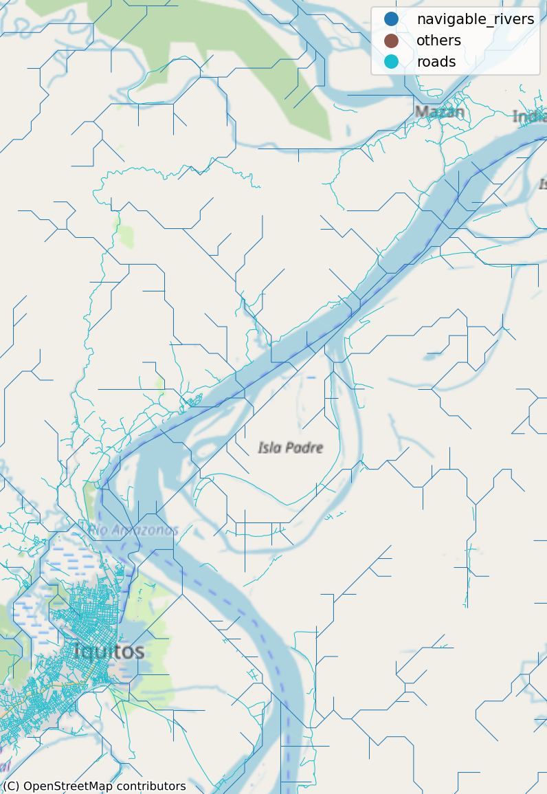

# Amazon Fluvial Transport Network for OSRM

This project processes the Amazon river and road network dataset to create a routing-ready format compatible with OSRM (Open Source Routing Machine), enabling accessibility analysis and route planning in the Amazon region where transportation primarily relies on waterways.

## Overview

The Amazon region faces unique geographical challenges for healthcare access due to its vast river network being the primary transportation mode. This project converts the comprehensive river and road dataset from Rocha et al. (2023) into OSRM-compatible format, enabling time-to-care analysis and accessibility studies in the International Amazon region.


*Visualization of the Amazon transportation network showing roads, waterways, and other infrastructure*

## Data Source

This project uses the river dataset published in:

> Rocha, T.A.H., Silva, L.L., Wen, F.H. et al. **River dataset as a potential fluvial transportation network for healthcare access in the Amazon region**. *Sci Data* 10, 188 (2023). https://doi.org/10.1038/s41597-023-02085-3

The original dataset combines data from OpenStreetMap, HydroSHEDS, and GloRiC to create a comprehensive transportation network that includes both roads and rivers as navigable routes in the Amazon Forest.

## Features

- **Data Processing Pipeline**: Converts the original river dataset to OSRM-compatible OSM format
- **Custom OSRM Profile**: Includes a specialized `fluvial.lua` profile designed for waterway routing
- **Visualization Tools**: Interactive maps showing routes and network analysis
- **Docker Integration**: Uses OSRM Docker containers for processing and routing
- **Route Examples**: Demonstrates routing capabilities in key Amazon cities (Iquitos, Manaus)

## Prerequisites

- Python 3.10+
- [uv](https://github.com/astral-sh/uv) (recommended for dependency management)
- Docker (required for OSRM processing)
- [osmium-tool](https://osmcode.org/osmium-tool/) (for OSM data conversion)
- Git

### Installing osmium-tool

On macOS:
```bash
brew install osmium-tool
```

On Ubuntu/Debian:
```bash
sudo apt-get install osmium-tool
```

## Installation

1. Clone this repository:
```bash
git clone https://github.com/Claudio9701/amazon_fluvial_transport_net.git
cd amazon_fluvial_transport_net
```

2. Install Python dependencies using [uv](https://github.com/astral-sh/uv):
```bash
uv sync
```

3. Download the original dataset:
   - Visit the [Nature Scientific Data article](https://www.nature.com/articles/s41597-023-02085-3)
   - Download the `rivers_database.rar` file
   - Convert it to ZIP format (the notebook expects a ZIP file)
   - Place it in the `inputs/` directory (or update the path in the notebook)

## Usage

### Step-by-Step Execution

Run the Jupyter notebook `data_cleaning.ipynb` step by step:

1. **Data Loading and Conversion**: Converts the ZIP file to Parquet format for efficient processing
2. **Data Exploration**: Analyzes the transportation network categories (roads, waterways, others)
3. **OSM Format Conversion**: Transforms the dataset to OpenStreetMap XML and PBF format
4. **OSRM Processing**: Uses Docker containers to prepare the routing data
5. **Route Testing**: Demonstrates routing capabilities with example queries

### Key Processing Steps

The pipeline includes:
- Converting shapefile data to GeoParquet
- Categorizing features into navigable waterways, roads, and other infrastructure
- Generating OSM XML with proper tagging
- Converting to OSM PBF format using osmium
- Processing through OSRM pipeline (extract, partition, contract, customize)
- Starting a local OSRM routing server

### Example Usage

```python
# Example route query between two points in the Amazon
start = [-59.868475, -3.190510]  # [longitude, latitude]
end = [-60.021018, -3.135563]
route = get_osrm_route(start, end)
```

### Route Examples

The system can calculate optimal routes using the combined road and river network:

**Route near Iquitos:**


**Route near Manaus:**


**Detailed view of river network near Iquitos:**


## Custom OSRM Profile

### The Fluvial Profile

This project includes a custom OSRM profile (`fluvial.lua`) specifically designed for Amazon waterway routing. The standard OSRM profiles (driving, walking, cycling) resulted in "0 edges" errors when processing the Amazon dataset, likely due to the unique nature of the waterway network.

**Key features of the fluvial profile:**
- Handles both road and waterway transportation modes
- Defines appropriate speeds for different transport types (ferry: 10 km/h, boats: 10 km/h)
- Manages access restrictions and routing preferences
- Supports mixed-mode routing (roads + rivers)

**⚠️ Community Input Needed**: This custom profile was developed with AI assistance to solve processing issues. **We welcome feedback from OSRM experts** to validate and improve the profile configuration for optimal waterway routing performance.

## Project Structure

```
├── data_cleaning.ipynb          # Main processing notebook
├── fluvial.lua                  # Custom OSRM profile for waterways
├── pyproject.toml              # Project dependencies
├── images/                     # Example visualizations
│   ├── rivers_amazon_plot.png  # Network overview
│   ├── iquitos_rivers_plot.png # Iquitos region detail
│   ├── route_iquitos.png       # Example route near Iquitos
│   └── route_manaus.png        # Example route near Manaus
├── inputs/                     # Input data directory
│   └── rivers_database.zip     # Original dataset (user-provided)
└── outputs/                    # Generated files
    ├── osm_amazonia_streets.parquet
    ├── rivers_amazon.osm
    ├── rivers_amazon.osm.pbf
    └── rivers_amazon.osrm.*    # OSRM routing files
```

## Dependencies

Key Python packages (managed via `pyproject.toml`):
- `geopandas`: Geospatial data processing
- `folium`: Interactive mapping
- `lxml`: XML processing for OSM format
- `polyline`: Route geometry encoding/decoding
- `contextily`: Basemap integration
- `matplotlib`: Static plotting
- `requests`: HTTP requests for routing API
- `pyarrow`: Efficient data serialization

External dependencies:
- `osmium`: OSM data manipulation (used via command line)
- `docker`: For OSRM processing

## Output Files

The processing pipeline generates:
- **Parquet file**: Efficient binary format of the original data
- **OSM XML**: OpenStreetMap-compatible format
- **OSM PBF**: Binary format for OSRM processing
- **OSRM files**: Complete routing graph ready for queries

## Applications

This dataset and processing pipeline enables:
- **Healthcare Accessibility Analysis**: Time-to-care studies in remote Amazon regions
- **Transportation Planning**: Route optimization for river-based transport
- **Emergency Response**: Rapid routing for medical emergencies
- **Research**: Academic studies on Amazon transportation networks

## Contributing

We encourage contributions, especially:
- Validation and improvement of the `fluvial.lua` OSRM profile
- Performance optimizations for large-scale routing
- Additional analysis tools and visualizations
- Documentation improvements

## Citation

If you use this work, please cite both this repository and the original dataset:

Original dataset citation:
```
Rocha, T.A.H., Silva, L.L., Wen, F.H. et al. River dataset as a potential fluvial 
transportation network for healthcare access in the Amazon region. 
Sci Data 10, 188 (2023). https://doi.org/10.1038/s41597-023-02085-3
```

Repository citation:
```
Claudio9701. (2023). Amazon Fluvial Transport Network for OSRM. Retrieved from https://github.com/Claudio9701/amazon_fluvial_transport_net
```

## License

This project is licensed under the MIT License - see the [LICENSE](LICENSE) file for details.

**Important**: This license applies to the software code and processing pipeline. The underlying dataset is subject to the licensing terms specified in the original publication:

> Rocha, T.A.H., Silva, L.L., Wen, F.H. et al. River dataset as a potential fluvial transportation network for healthcare access in the Amazon region. Sci Data 10, 188 (2023).

Users must comply with both this license and the original dataset's licensing terms. Please refer to the original publication for dataset-specific usage rights and restrictions.

## Support

For questions or issues:
- Open an issue on GitHub
- Refer to the original dataset documentation
- Check OSRM documentation for routing-specific questions

---

**Note**: This project is designed for research and analysis purposes. For production use in critical applications (emergency response, etc.), please thoroughly validate the routing accuracy against ground truth data.
